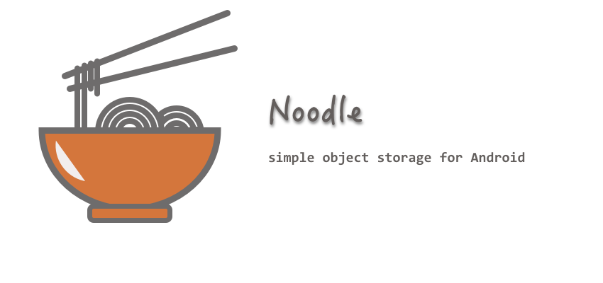

[](https://travis-ci.org/nolia/Noodle)   [](https://jitpack.io/#nolia/Noodle)
---


Noodle is a simple object storage for Android.

### Download

Get it from JitPack.


```
repositories {
    ...
    maven { url 'https://jitpack.io' }
}

dependencies {
    compile 'com.github.nolia:Noodle:master-SNAPSHOT'
}
```

## Usage

You can use Noodle both as a key-value storage and as collection persistence framework.
To initialize Noodle you can use builder:
```java
Noodle noodle = Noodle.with(context).build();
```

### Key-value storage

You can put any type of object to the storage.
```java
noodle.put("Android7", "Nougat").now();
```

Get stored value.
```java
T value = noodle.get("myObject", T.class).now();
```

Remove the data.
```java
boolean isRemoved = noodle.delete("toRemove").now();
```

### Collections
Using collections is also really simple: no schema, no relations, no consistency rules, no thread-contained objects.
Just create Noodle instance and register types you want to store. The only requirement, that class should have
an annotated id field with type of `Long` or `long`.

```java
class Book {

  @Id
  long id;

  String title;
  String author;

  public Book(String title, String author) {
    this.title = title;
    this.author = author;
  }
}

Noodle noodle = Noodle.with(context)
  .addType(Book.class)
  .build();

```
Alternatively, if you don't want or not able to add annotation to the class,
you can use `Description`. You can provide either the name of the field (that it
would be set with reflection mechanism):

```java
Noodle noodle = Noodle.with(context)
  .addType(Book.class, Description.of(Book.class)
    .withIdField("id")
    .build()
  );
```
Or you can specify *get* and *set* methods:
```java
Noodle noodle = Noodle.with(context)
  .registerType(Book.class, Description.of(Book.class)
    .withGetIdOperator(book -> book.id))
    .withSetIdOperator((book, id) -> book.id = id)
    .build()
  );
```
This allows you to use other types as an Id field.

Collections allow you to *list*, *put*, *delete*, *get* (by id) and *filter* your objects.

```java
collection = noodle.collectionOf(Book.class);

Book book = new Book("I Robot", "Isaac Asimov");

// Get all.
List<Book> list = collection.all().now();

collection.put(book).now();
// Now, book object has updated id.

// Update:
book.title = "I, Robot";
collection.put(book).now();

// Delete:
collection.delete(book.id).now();
```

### Filter
```java
List<Book> search(final String query) {
  return collection.filter(new Collection.Predicate<Book>() {
    @Override
    public boolean test(final Book book) {
      return book.title.contains(query)
          || book.authorName.contains(query);
    }
  }).now();
}
```
Filtering is happening in memory, by pulling objects one by one and testing with provided predicate.

### Threading
Each operation on collections and key-value storage is synchronized on **Storage** level.
This means that can be only one read/write operation at a time.

All methods return `Result` object, which wraps the actual results,
that you can access either with synchronous `now()` method, or with callback and `get()` method.

```java
collection.filter(new Collection.Predicate<Book>() {
      @Override
      public boolean test(final Book book) {
        return book.title.contains(query);
      }
    })
    .executeOn(Executors.newSingleThreadExecutor())
    .withCallback(new Result.Callback<List<Book>>() {
      @Override
      public void onReady(final List<Book> books) {
        adapter.setBooks(books);
      }

      @Override
      public void onError(final Exception e) {
        Log.e(TAG, 'Error getting books:', e);
        Toast.makeText(context, "Could not get your books :(", Toast.LENGTH_SHORT).show();
      }
    })
    .get();
```

### Rx Support
If you prefer RxJava, Noodle is got you covered. You can convert any `Result` of the operation to `Observable`:
```java
collection.put(book)
    .toRxObservable()
    .subscribe();
```
**Notes**:

- RxJava v2 is used, so incompatible with version 1
- Noodle does not ship RxJava transitively, so you have to provide it as a dependency
- When doing `get` and `delete` operations, if item is not found, Noodle is returning `null`.
But if using rx wrapper, due to that it does not allow null emissions, you will get `NullPointerException`
in the `onError` callback.

### Configure

```java
Noodle noodle = Noodle.with(context)
    .converter(converter)
    .filePath(path)
    .encryption(encryption)
    .build();
```

Every component is pluggable, but Noodle provides defaults:

  - converter - Gson for converting objects to JSON and then to byte arrays
  - encryption - `NoEncryption` is by default, so nothing is encrypted, but you can easily implement one (it only has 2 methods)


### Features:

- [X] Key-value storage
- [X] Simple collection storage
- [X] Simple annotation processing for entities ids
- [X] Rx Support
- [X] Encryption

### License
MIT license, see more [here](LICENSE.md).

